# Sbolt 🛵

A full-stack, scooter-hailing platform built end-to-end — native iOS app + FastAPI backend — covering the complete rider and driver experience.
 
📱 iOS app (this repo) · ⚙️ [Backend repo](https://github.com/MahmoudAdel11/Sbolt-Backend)

## Demo

<table align="center">
  <tr>
    <th>Rider Experience</th>
    <th>Driver Experience</th>
  </tr>
  <tr>
    <td>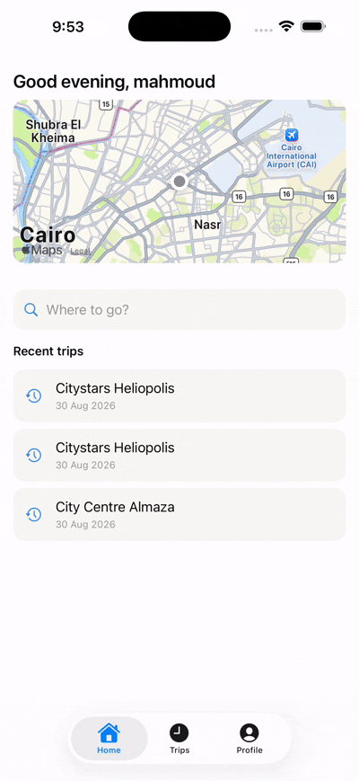</td>
    <td>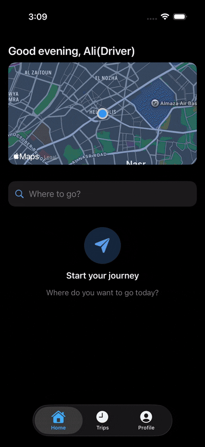</td>
  </tr>
</table>

### Screenshots

  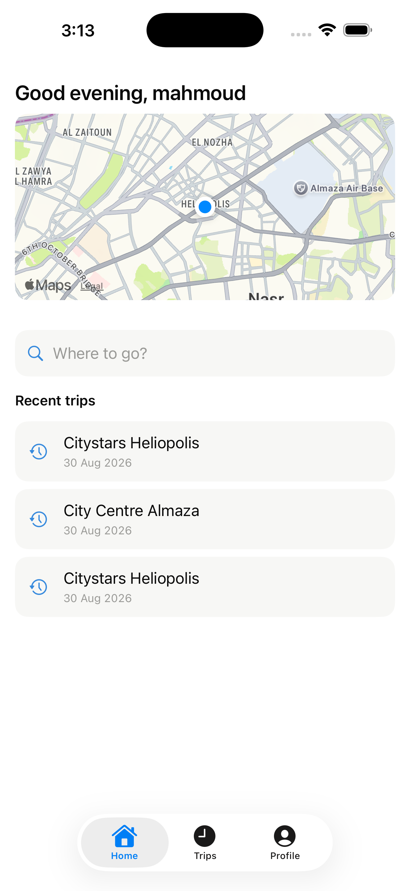
  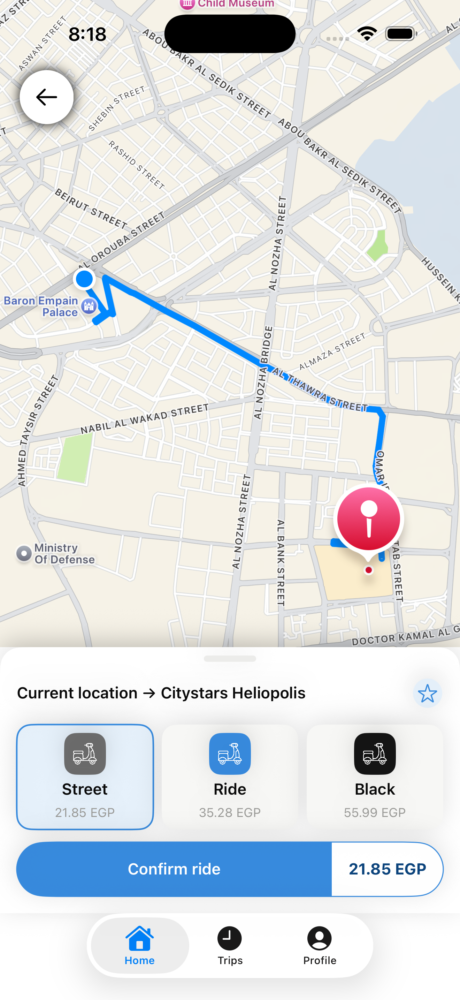
  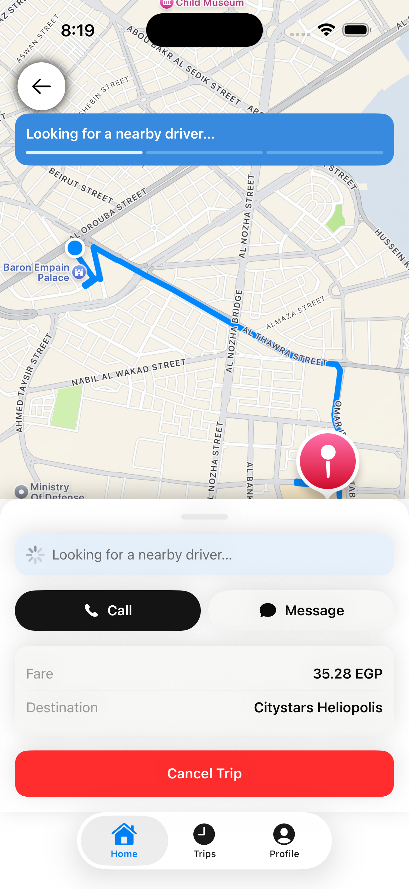
  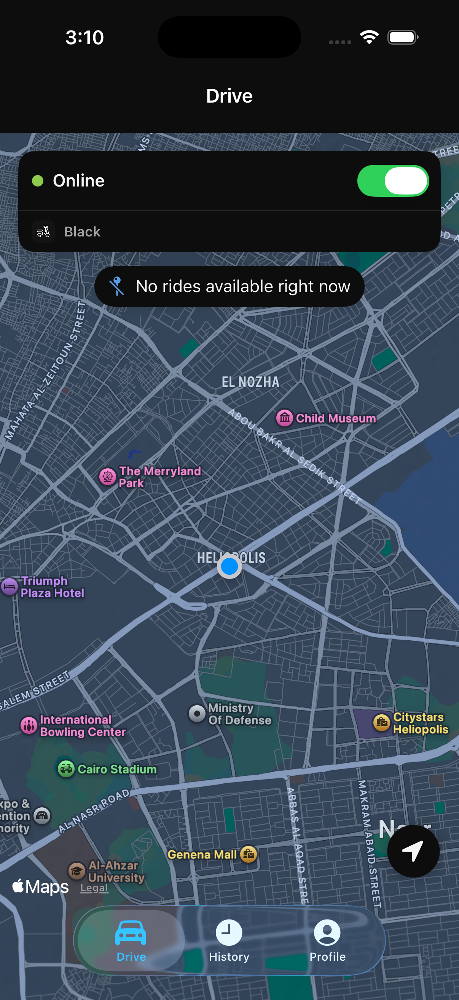

  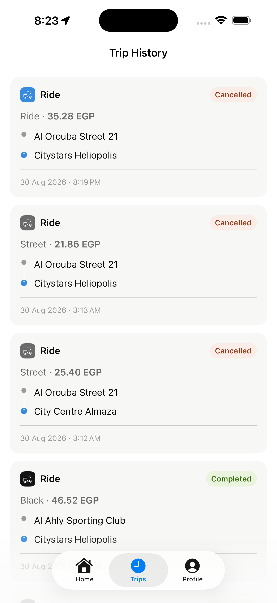
  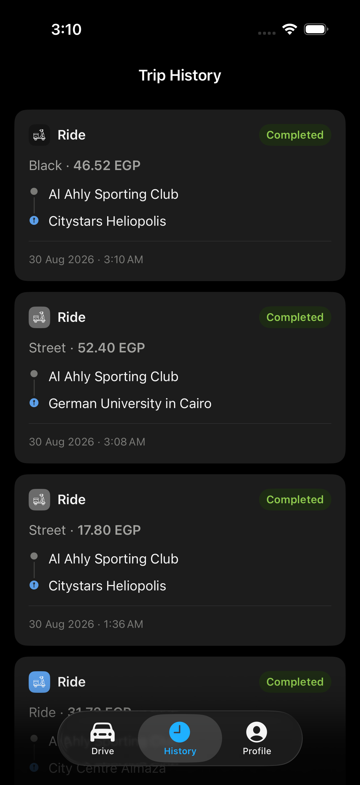
  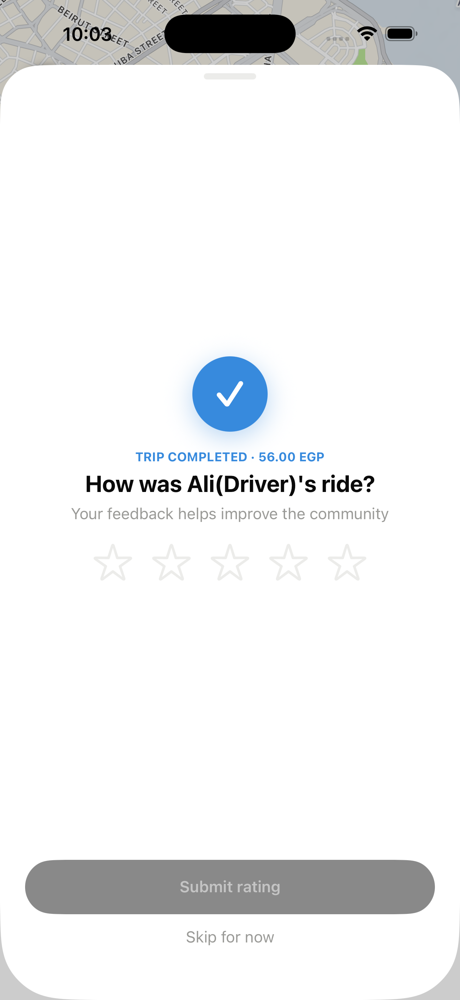
  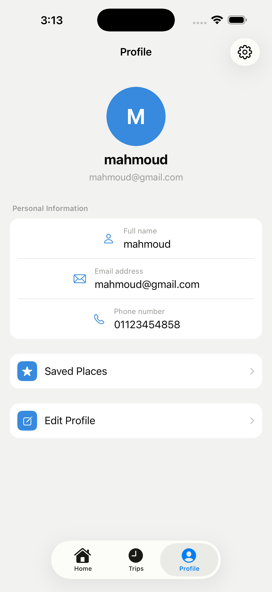
  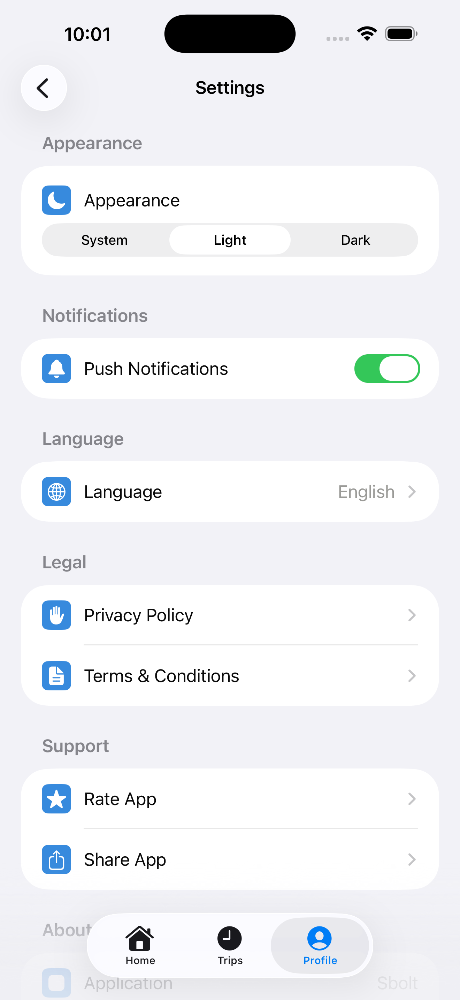

## Overview

Sbolt started as a generic ride-hailing clone and evolved into a focused, scooter-only platform with three service tiers (Street / Ride / Black), a full driver-side experience, and a from-scratch professional UI redesign supporting both Light and Dark Mode.

The project was built iteratively, sprint by sprint, with a strict discipline: every integration was verified against a **real, running backend** — not mocks — because early on, a mock-only verification pipeline let a serious bug (the app never actually talked to the live backend) go unnoticed for several sprints. That discovery reshaped how every feature afterward was tested.

## Features

### Rider Experience
- Email/password registration & login with **sliding-expiration refresh tokens** (silent, automatic re-authentication — no more "session expired" interruptions)
- Real-time ride requests with **live driver tracking** via polling
- **3-tier scooter selection** (Street / Ride / Black), each with its own server-computed fare (base price + distance-based rate)
- Save and reuse favorite places (Home, Work, custom locations) — including saving a destination directly from an active ride request
- Trip history with pagination and **reverse-geocoded addresses** (real place names instead of raw coordinates)
- Post-ride **star rating** system for drivers
- Full Light/Dark Mode support with a proper System/Light/Dark appearance control

### Driver Experience
- Toggle online/offline availability
- Live map of nearby available ride requests, filtered by the driver's own scooter tier (a "Black" driver sees Black + Ride + Street requests; a "Street" driver sees only Street)
- Accept, start, and complete rides, with an enforced "must start before completing" flow
- Vehicle & scooter-type settings, editable after registration
- Driver rating and trip history

### Cross-Cutting
- **Row-level database locking** to prevent two drivers from accepting the same ride simultaneously
- **Active-ride recovery** — reopening the app after a force-quit correctly restores an in-progress ride instead of losing it
- Clean separation between rider-facing and driver-facing data (no PII leakage — a rider never sees a driver's phone number or email, for example)

## Tech Stack

### iOS
| | |
|---|---|
| Language | Swift 6 |
| UI | SwiftUI |
| Architecture | MVVM + Clean Architecture (Domain / Data / Presentation) |
| Concurrency | Structured concurrency (`async`/`await`, `async let`) |
| Networking | Custom `URLSession`-based client with automatic retry and token-refresh interceptors |
| Maps | MapKit, via custom `UIViewRepresentable` wrappers |
| Location | `CLGeocoder` (reverse geocoding), `CLLocationManager` |
| Persistence | Keychain (secure token storage) |
| Testing | XCTest, stub-based repository testing (no live network calls in unit tests) |

### Backend
| | |
|---|---|
| Framework | FastAPI (Python) |
| Database | PostgreSQL |
| ORM | SQLAlchemy (async) |
| Migrations | Alembic |
| Auth | JWT — short-lived access tokens + DB-backed, sliding-expiration refresh tokens |
| Architecture | Clean Architecture (API / Application / Domain / Infrastructure) |
| Testing | pytest, real HTTP round-trip integration tests against a live Postgres instance |

## Architecture Highlights

- **Repository Pattern** on both client and server, with protocol/interface-based abstractions — swapping a mock repository for a real one requires no changes to any ViewModel or UseCase.
- **Dependency Injection** throughout; no singletons carrying business logic.
- **Tier-hierarchy filtering**: available-ride queries filter by the driver's scooter tier using a simple rank comparison, computed with zero extra database queries.
- **Sliding-expiration refresh tokens**: a DB-backed session (not a second stateless JWT), because sliding expiration requires extending an existing session in place — something a JWT's baked-in expiry can't do without minting a new token anyway.
- **Silent token refresh**: a single interception point (`AuthenticatedAPIClient`) catches 401s, attempts one refresh, and retries the original request once — invisible to the rest of the app.

## What I'd Do Differently

- Add real-time push notifications for new ride requests instead of polling.
- Introduce a proper rating/review moderation flow.
- Add manual verification (photo upload + admin review) for driver-declared scooter types, rather than a pure trust model.
- Build out an admin panel for the tier pricing (currently a hardcoded backend constant).

## Known Limitations (tracked, not hidden)

- No real-time messaging/calling channel between rider and driver (the backend deliberately excludes phone numbers as PII from the rider-facing driver summary).
- No live ETA — the backend doesn't currently compute driver-to-pickup distance/time.
- Driver scooter type is self-declared at registration with no verification step (acceptable for this project's scope; a production system would require photo/document verification).

---

Built solo, end-to-end, over several months of iterative sprints — backend, iOS, and full UI/UX design.
